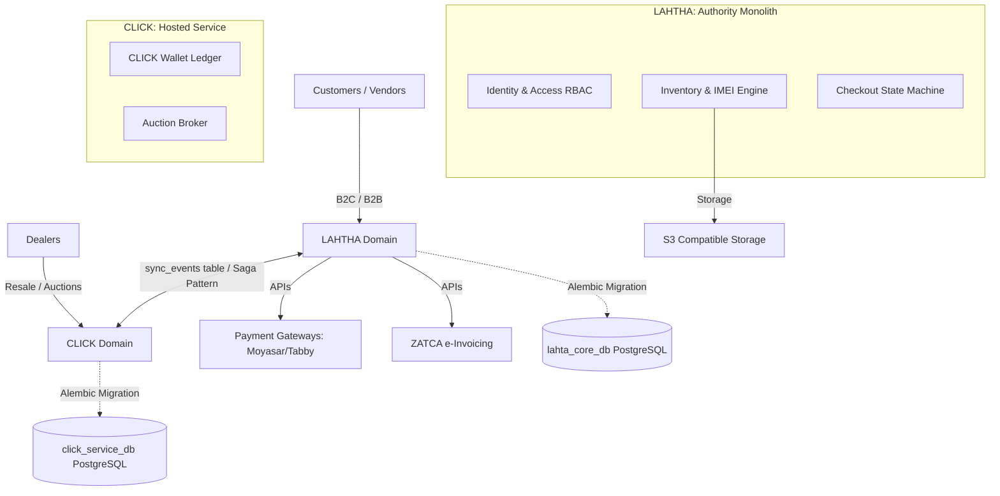

# العرض المعماري لمنظومة LAHTHA & CLICK
## التحليل الفني ومخطط التصميم (Technical Blueprint)
**إعداد: كبير مهندسي الحلول (Principal Solution Architect)**

---

## 1. الهدف الأساسي للنظام (Core System Objective)
* تعمل المنصة كنظام بيئي رقمي ثنائي الجوانب.
* **LAHTHA:** تعمل كوسيط موثوق للتجارة الإلكترونية (B2C/B2B) متخصص في أجهزة Apple الجديدة، مع فرض ضوابط صارمة على المخزون (أرقام IMEI/التسلسل) والفوترة.
* **CLICK:** خدمة أعمال مدمجة، ولكنها معزولة مالياً وتشغيلياً، ومخصصة لإعادة البيع الفوري ومزادات التجار.
* **القيمة المضافة:** حل مشكلة توفير سيولة فورية في السوق الثانوية (عبر الممتلكات الرقمية)، مع الحفاظ على الامتثال الصارم للسوق الأولية، والالتزام الضريبي، وقابلية التدقيق غير القابلة للتغيير.

---

## 2. النمط المعماري المقترح (Proposed Architectural Pattern)
* **التوصية:** بنية متجانسة تركيبية تعتمد على الأحداث (Event-Driven Modular Monolith).
* توثيق النظام يفرض فصلاً منطقياً صارماً بين LAHTHA (السلطة الرئيسية) و CLICK (الخدمة المستضافة).
* **المرحلة الأولى (Phase 1):** الانتقال من بنية Monolith تقليدية بقاعدة بيانات SQLite إلى بنية Modular Monolith مع قاعدة بيانات PostgreSQL لتثبيت المنتج الأولي (MVP).
* يتم التواصل بين النطاقات (Domains) حالياً عبر جدول `sync_events`.
* **المراحل المستقبلية (Phase 3/4):** مع توسع حجم العمليات، سيتم الانتقال إلى بنية الخدمات المصغرة (Microservices)، واستبدال جدول المزامنة بناقل أحداث (Event Bus) مثل Kafka أو SQS لربط قواعد البيانات المعزولة.

---

## 3. الوحدات الوظيفية الرئيسية (Key Functional Modules)
1. **إدارة الهوية والوصول (IAM):** مزامنة الملفات الشخصية الرئيسية (بائعين، عملاء، تجار) مع تطبيق التحكم في الوصول القائم على الأدوار (RBAC).
2. **محرك المخزون والتحقق:** فهرسة الأجهزة مع قيود صارمة على مستوى قاعدة البيانات لفرادة رقم (IMEI)، وإرفاق البيانات الوصفية لمستندات إثبات الملكية.
3. **آلة حالة الدفع (Checkout State Machine):** مسار مزدوج يوجه المشتريات إما إلى التنفيذ الفعلي (المنطق الخاص بالشحن) أو الضمان الرقمي (تنفيذ اتفاقية ممتلكاتي).
4. **دفتر أستاذ محفظة CLICK:** دفتر أستاذ تشغيلي يشبه الضمان (Escrow) لإدارة أرصدة التجار، وتكوينات قواعد الشراء الفوري، وسجلات التسوية.
5. **وسيط المزادات (Auction Broker):** استيعاب العطاءات في الوقت الفعلي، حجز الأموال الاحتياطية، تدفقات الإغلاق الآلي، وتسوية الفائزين بشكل متزامن.

---

## 4. المتطلبات غير الوظيفية الحرجة (NFRs)
* **الأمان والهوية:** يتطلب الأمر الانتقال من المصادقة الأساسية إلى حل JWT/OAuth قوي أو مزود هوية مؤسسي (Enterprise IdP) قبل الإطلاق الفعلي للإنتاج.
* **التشفير وسلامة البيانات:** حظر تام لاستخدام منطق الفاصلة العائمة (floating-point) في العمليات المالية؛ يجب أن تستخدم جميع الأنظمة النقدية أنواع بيانات آمنة للأرقام العشرية (decimal-safe).
* **الثبات (Immutability):** كل تغيير مالي أو ضريبي أو حالة مخزون يجب أن يُنشئ سجل تدقيق زمني غير قابل للتغيير يوضح الفاعل، الخدمة المصدر، والمجاميع الصافية.
* **الامتثال:** يجب أن يتعامل النظام ديناميكيًا مع ضريبة القيمة المضافة والرسوم القابلة للتكوين، ويتكامل بسلاسة مع معايير ZATCA للفوترة الإلكترونية.

---

## 5. نقاط التكامل وتدفق البيانات (Integration & Data Flow)
* **بوابات الدفع المالية:** تصميم محولات (Adapters) لمزودي الدفع الأساسيين مثل (Moyasar, Checkout.com) وخدمات الشراء الآن والدفع لاحقاً (Tabby, Tamara).
* **واجهات برمجة التطبيقات للامتثال:** تدفق البيانات الخارجي إلى مزودي الفوترة الإلكترونية المعتمدين من ZATCA.
* **التخزين والاتصالات:** تكامل مع مساحة تخزين كائنات متوافقة مع S3 لإدارة مستندات البائعين بشكل آمن، إلى جانب مشغلات (Webhooks) غير متزامنة لإشعارات الرسائل القصيرة/واتساب.

---

## 6. المخاطر التقنية والفجوات (Technical Risks & Gaps)
* **احتكاك ترحيل قواعد البيانات:** يتطلب التحديث من SQLite إلى PostgreSQL التنفيذ الفوري لعمليات الترحيل باستخدام Alembic. الفشل في تثبيت هذا المخطط الآن سيعيق دمج قواعد الأعمال المعقدة.
* **التزامن وحالات السباق (Race Conditions):** يفتقر نموذج المزاد إلى آليات القفل المحددة. تتطلب العطاءات عالية التردد قفلًا تشاؤميًا لقاعدة البيانات (Pessimistic Locking) لمنع التخصيص الزائد لأرصدة محفظة التاجر أثناء دورات الحجز/التحرير.
* **سلامة المعاملات الموزعة:** الاعتماد على عقود API و `sync_events` بين LAHTHA و CLICK يُدخل خطر فشل الاتساق النهائي (eventual consistency). من الناحية المعمارية، يجب تعريف منطق التعويض (Saga pattern) لعمليات التسليم المتزامن الفاشلة (مثل نجاح بيع CLICK ولكن فشل نقل ملكية LAHTHA).

---

## 7. المخطط المعماري المبدئي (Mermaid Diagram)

