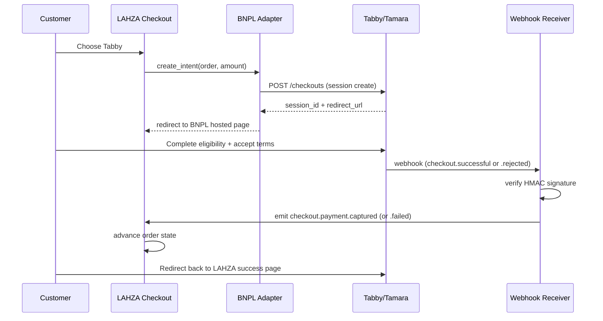

# ADR-0002 — BNPL First: Tabby + Tamara in Phase 1, Direct Gateways in Phase 2

| | |
|---|---|
| **Status** | Proposed |
| **Date** | 2026-05-26 |
| **Decision owners** | Product + Engineering + Owner |
| **Supersedes** | The ordering of payment providers in [`../architecture/payment-gateway-adapters.md`](../architecture/payment-gateway-adapters.md) — that doc to be updated in a follow-up |

## Context

LAHZA needs to accept customer payments at launch. Two classes of payment providers exist:

1. **Direct payment gateways** (Moyasar, Checkout.com, mada direct, Apple Pay) — accept card, mada, Apple Pay, etc. Require a **merchant bank account** with KSA bank documentation: CR, VAT certificate, beneficial-owner KYC, bank IBAN proof.
2. **Buy-Now-Pay-Later (BNPL)** (Tabby, Tamara) — installment-style payment. Onboarding is faster: typically requires CR + VAT cert + bank IBAN, but **no acquirer relationship** because the BNPL provider acts as the financial counterparty.

At launch:
- The owner has CR + VAT cert but is still finalizing the **acquirer / bank merchant agreement** for direct gateways. This is normal — KSA bank onboarding for card acquiring often runs 4–8 weeks.
- BNPL onboarding can complete in 1–2 weeks with current documentation.
- Tabby + Tamara together cover a large share of KSA online checkout (especially for phones in the 2,000–6,000 SAR range — LAHZA's sweet spot).

We need revenue and real-world signal **now**, not after the bank paperwork closes.

## Decision

**Phase 1 (launch): Tabby + Tamara only.**

- The `PaymentAdapter` contract from [`payment-gateway-adapters.md`](../architecture/payment-gateway-adapters.md) is implemented for Tabby and Tamara first.
- Both BNPLs are shown side by side at checkout, with the customer choosing one.
- The system architecture continues to assume the multi-adapter model — direct gateways slot in later **without code changes to the checkout state machine**.

**Phase 2 (after merchant paperwork closes): direct gateways.**

- Moyasar first (broad KSA card + mada coverage, fastest sandbox-to-prod path).
- Checkout.com second (better international support, useful for B2B).
- Apple Pay / Google Pay rides on top of either, as a presentation layer.
- These are added as new adapters; the BNPL options remain.

**Phase 3 (longer term):** mada direct integration (lower per-transaction cost than going through a processor), conditional on volume justifying it.

## Why this ordering

| Concern | BNPL-first answer |
|---|---|
| **Time to revenue** | Days, not weeks |
| **Required paperwork** | What the owner already has |
| **Match for product** | Phone purchases in the 2,000–6,000 SAR range are the textbook BNPL use case |
| **Customer trust signal** | Tabby + Tamara badges are familiar to KSA shoppers — a launch credibility boost |
| **Architecture risk** | Zero — the adapter pattern was designed for exactly this |
| **Cost** | BNPL fees (4–6%) are higher than direct (2–3%), but launching now beats waiting at zero revenue |

## Adapter design notes (specific to BNPL)

Both Tabby and Tamara share a flow that differs from card-style direct gateways:

Key adapter contract points:
- **`intent_id`** is namespaced (`tabby:co_xxx`, `tamara:co_xxx`) to keep audit clear.
- **No capture step** — BNPL settles in one shot via webhook; no separate authorize + capture.
- **Refunds** are full-flow: `POST /refunds` on the provider, await webhook, then trigger ledger reversal.
- **Eligibility failures** are common (≈ 20% in some studies). UX must gracefully fall back to "pick another method" — this is exactly why we need ≥ 2 providers from day one.

## Stub adapter for direct gateways (Phase 1)

To prove the architecture, the codebase will include a **stub adapter** for Moyasar that throws `NotConfiguredError` if invoked. The checkout state machine treats it as "available method, but disabled" — surfaced in admin config as "awaiting credentials".

This:
- Validates the multi-adapter pattern actually works.
- Lets admins toggle the method on the day credentials arrive without a deploy.
- Forces tests to cover the "unavailable provider" UX path early.

## Consequences

### Positive
- Launch in 1–2 weeks instead of 6–8.
- The pattern proves itself before we add complexity.
- BNPL provides a built-in fraud filter (Tabby/Tamara underwrite the buyer).

### Negative
- Higher transaction cost in Phase 1 (BNPL fees). Margin impact is acceptable given the launch-now value.
- Some customers expect to pay by card directly — Phase 1 will show "أو ادفع بالكامل عبر مدى — قريباً" to set the expectation.

### Mitigations
- Track Phase 1 conversion data: if customers abandon at the payment step looking for a card option, escalate the direct gateway timeline.
- Track BNPL approval rate per provider; rebalance display order monthly to maximize first-try success.

## Implementation plan

1. Implement `BnplAdapter` extending `PaymentAdapter`.
2. Tabby adapter + sandbox integration tests.
3. Tamara adapter + sandbox integration tests.
4. Webhook receiver (shared) with HMAC verification per provider.
5. Moyasar stub adapter (throws `NotConfiguredError`, enables UI placement).
6. Admin config: per-provider on/off toggle.
7. Checkout UI: show available BNPLs, BNPL-first messaging.
8. Reconciliation jobs per provider — daily settlement pull.

## Open questions

- **Tabby vs Tamara display order** at checkout: A/B test in week 1.
- **Refund SLA** with each provider — confirmed with each in onboarding.
- **mada-only Apple Pay** without a card acquirer: provider-specific, check with each BNPL whether their mada-rail covers the case.
