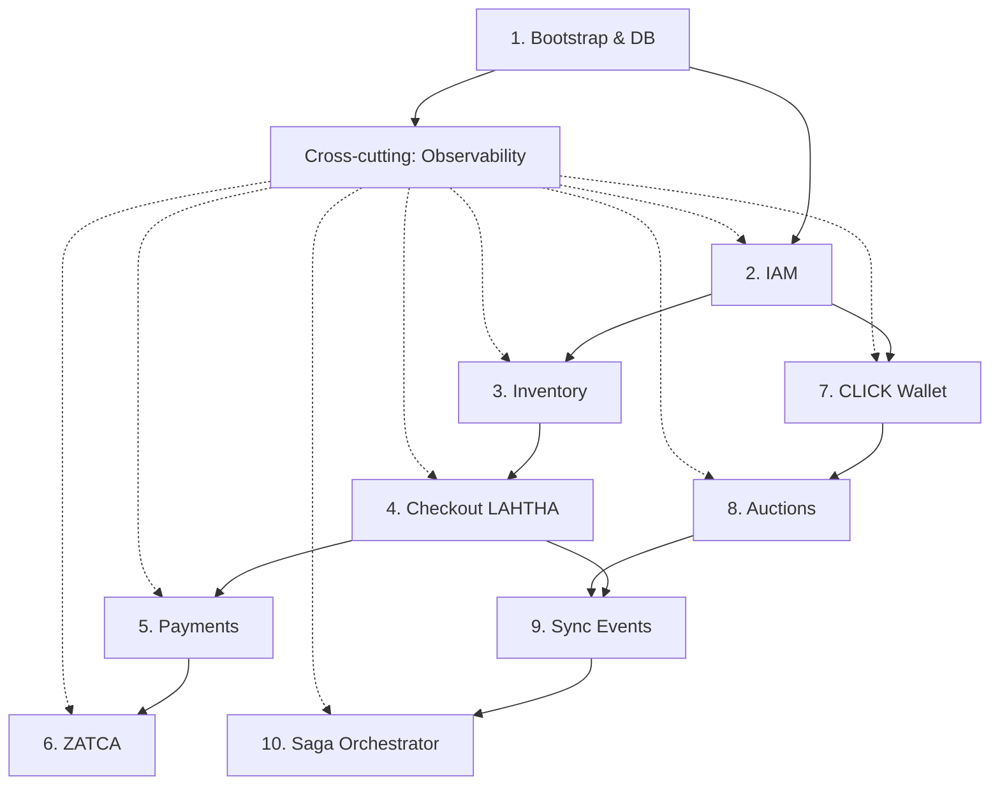

# Architecture Docs — LAHTHA & CLICK

Single entry point for the platform's technical design. The blueprint lives in [`../../ARCHITECTURE.md`](../../ARCHITECTURE.md); every doc here drills into one of its sections.

## Index

| # | Doc | Covers | Blueprint section |
|---|---|---|---|
| 1 | [`saga-compensation.md`](./saga-compensation.md) | Cross-domain transaction integrity (LAHTHA ↔ CLICK) | §6 |
| 2 | [`auction-concurrency.md`](./auction-concurrency.md) | Locking strategy for high-frequency bidding | §6 |
| 3 | [`zatca-integration.md`](./zatca-integration.md) | ZATCA Phase 2 e-invoicing (clearance + reporting) | §4–§5 |
| 4 | [`imei-inventory-schema.md`](./imei-inventory-schema.md) | Device, ownership, document tables | §3.2 |
| 5 | [`iam-rbac.md`](./iam-rbac.md) | Identity, principals, RBAC, auth evolution | §3.1, §4 |
| 6 | [`payment-gateway-adapters.md`](./payment-gateway-adapters.md) | Moyasar / Checkout.com / Tabby / Tamara contract | §5 |
| 7 | [`click-wallet-ledger.md`](./click-wallet-ledger.md) | Double-entry ledger and balance projection | §3.4 |

If you add a new doc: append a row here, then link back to this README from the new doc's header.

---

## Phase 1 implementation roadmap

Ordering for the MVP (build top-to-bottom — later items depend on earlier ones).

| # | Workstream | Depends on | Acceptance |
|---|---|---|---|
| 1 | **Bootstrap & DB** — repo skeleton, Alembic baseline, Postgres up | — | `alembic upgrade head` works locally + CI |
| 2 | **IAM** — `persons`, `users`, `roles`, sessions, OTP | 1 | a vendor can complete KYC and log in |
| 3 | **Inventory** — `devices`, `device_ownership`, `device_documents`, S3 upload | 1, 2 | vendor can register an IMEI with proof docs |
| 4 | **Checkout (LAHTHA)** — order state machine, dual path (fulfillment vs digital custody) | 3 | customer can place an order; state advances on payment event |
| 5 | **Payments** — adapter framework + Moyasar adapter first; webhook receiver | 4 | end-to-end purchase with sandbox Moyasar |
| 6 | **ZATCA** — bridge service, signing, audit | 5 | every captured order produces a signed XML, sandbox-cleared |
| 7 | **CLICK wallet** — ledger, accounts, top-up flow | 2 | dealer can top up and see balance |
| 8 | **Auctions** — listings, bids, reserve/release, auto-close | 7 | dealer can list, bid, auction can close |
| 9 | **Sync events** — `sync_events` table + consumer loop | 4, 8 | events emitted by LAHTHA visible to CLICK consumer |
| 10 | **Saga orchestrator** — auction settlement with compensation | 8, 9 | full happy + failure path traced in tests |

Cross-cutting: observability (below) — wired in from workstream 1 and required for every workstream's acceptance.

---

## Cross-cutting foundations (build these from day one)

These cost little when set up early and a lot when retrofitted.

### Observability
Three pillars, all required:

**Logs (structured JSON):**
- Every request, job, webhook handler emits one structured log line per outcome.
- Mandatory fields: `timestamp`, `level`, `service`, `correlation_id`, `actor`, `event`, `outcome`, `duration_ms`.
- `correlation_id` flows from inbound request → all downstream calls → emitted events → sync_events consumers.
- Library: `structlog` (Python) — single processor pipeline; never `print()`.

**Metrics (Prometheus):**
- RED for every HTTP endpoint: **R**ate, **E**rrors, **D**uration (histogram).
- USE for every dependency: **U**tilization, **S**aturation, **E**rrors.
- Business metrics: `orders_created_total`, `bids_accepted_total`, `wallet_drift_sar` (gauge).

**Tracing (OpenTelemetry):**
- One span per HTTP handler, DB query (sampled), saga step, webhook receipt.
- Trace IDs propagated as W3C `traceparent` headers and persisted on `sync_events` rows.
- Phase 1 backend: Tempo or Jaeger; OTel collector as the sidecar.

**SLOs (initial targets):**
| Service | SLI | Target |
|---|---|---|
| Checkout API | p95 latency | < 300ms |
| Bid acceptance | p95 latency | < 80ms |
| Saga settlement | p95 end-to-end | < 5s |
| Webhook receiver | availability | 99.9% monthly |
| ZATCA clearance | success rate | 99.5% monthly |

### Decision records (ADRs)
- Location: `docs/adr/` (creates on first ADR).
- Format: [MADR](https://adr.github.io/madr/) — short, decision-focused.
- Trigger: anything that closes off an alternative for ≥ 6 months (DB choice, auth model, payment provider primary, etc.).
- File name: `0001-postgres-as-primary-db.md`, monotonic.

### Environment matrix
| Env | Purpose | Data | Secrets | Provider sandboxes |
|---|---|---|---|---|
| `local` | dev laptops | seeded fixtures | `.env.local` (gitignored) | sandbox |
| `ci` | tests on PR | ephemeral | env-injected | mocked |
| `staging` | pre-release | scrubbed copy of prod | Secrets Manager | sandbox |
| `prod` | live | live | Secrets Manager + KMS | live |

No env shares secrets with another. No PII in `staging` — scrubber runs on every restore.

### Secrets management
- All secrets in **AWS Secrets Manager** (or Vault) — never in env files, never in repo.
- 90-day rotation policy for API keys (HMAC, payment gateway).
- HSM-backed keys for ZATCA signing (see [`zatca-integration.md`](./zatca-integration.md)).
- Local dev uses developer-scoped sandbox credentials; production credentials never leave their account.

### CI/CD discipline (Phase 1 baseline)
- PR pipeline: lint, type-check, unit tests, Alembic migration dry-run, OpenAPI diff.
- Main pipeline: full test suite, integration tests against ephemeral Postgres, build container, push to registry.
- Deploy: manual promotion to staging → smoke tests → manual promotion to prod (no auto-deploy to prod in Phase 1).

### Migration discipline
- Every schema change is an Alembic revision; no manual DDL in any env.
- Migrations must be **online**: never lock a hot table for > 1s.
- Adding indexes: `CREATE INDEX CONCURRENTLY` in a separate migration from the schema change.
- Dropping columns: two-phase (stop writing → release → drop in a later release).

---

## How to add a new architecture doc
1. Create `docs/architecture/<topic>.md` with a header linking back to `ARCHITECTURE.md` and this README.
2. Add the row in the Index above (keep it in dependency order if possible).
3. If the doc closes off an alternative, also drop an ADR under `docs/adr/`.
4. Open a draft PR; mark ready when at least one other engineer has reviewed.
