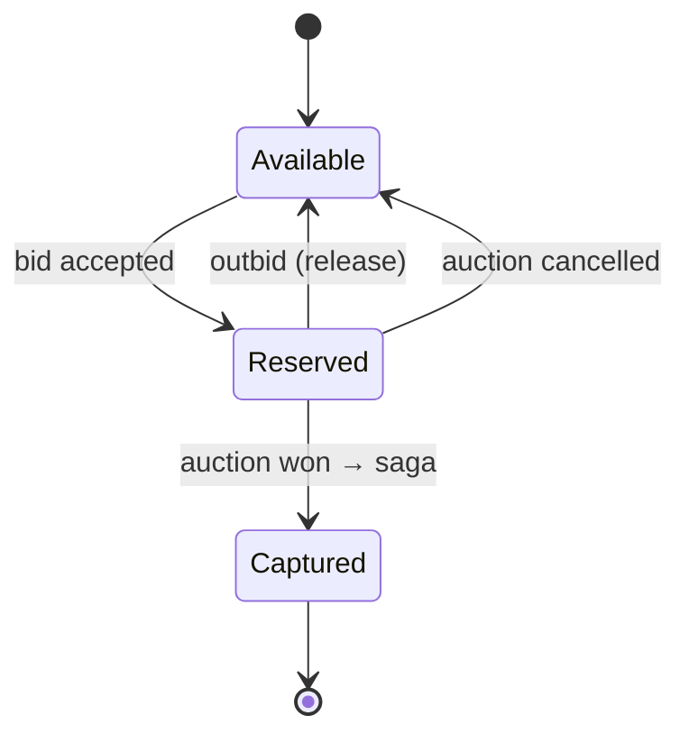

# Auction Concurrency & Locking — CLICK

> Follow-up to [`ARCHITECTURE.md`](../../ARCHITECTURE.md) §6: "Race conditions in the auction model".

## Risks under load
Target peak: **200+ bids/sec on hot items**, **500 concurrent bidders**, **50 simultaneously open auctions**.

| Risk | Failure mode |
|---|---|
| Wallet double-reserve | Dealer with 10k SAR reserves 8k on auction A and 8k on auction B in the same instant |
| Bid race | Two dealers' "place 5,000" bids both accepted at the same price |
| Auto-close skew | Two workers both try to close the same auction; double-emit `auction.won` |
| Reserve leak | App crashes after reserving but before persisting the bid → wallet stuck |

## Locking strategy by surface

### 1. Wallet reserves — pessimistic row lock
Wallet writes are the only place we **block**.
```sql
BEGIN;

SELECT available_balance
  FROM dealer_wallets
 WHERE dealer_id = $1
 FOR UPDATE;  -- serializes concurrent reserves for THIS dealer

UPDATE dealer_wallets
   SET reserved_balance  = reserved_balance  + $2,
       available_balance = available_balance - $2
 WHERE dealer_id = $1
   AND available_balance >= $2;

INSERT INTO wallet_reservations (reservation_id, dealer_id, auction_id, amount)
VALUES ($3, $1, $4, $2);

COMMIT;
```
- Lock scope: **one wallet row**. Two different dealers never block each other.
- Target hold time: **< 5ms**.
- `available_balance >= $2` in the `WHERE` guarantees we **never** overdraw, even if the `SELECT` is stale.

### 2. Bid acceptance — optimistic with version
Bids are read-heavy; lock-free.
```sql
UPDATE auctions
   SET current_bid    = $new_bid,
       current_bidder = $dealer_id,
       version        = version + 1
 WHERE auction_id = $1
   AND version    = $expected_version
   AND status     = 'open'
   AND current_bid < $new_bid;
-- 0 rows affected → retry from read
```
- No row lock held across the client round-trip.
- Conflict resolution: client retries up to 3x with a fresh read.

### 3. Auto-close — single-writer with `SKIP LOCKED`
One worker (leader-elected via Postgres advisory lock) polls every 200ms:
```sql
SELECT auction_id
  FROM auctions
 WHERE status   = 'open'
   AND end_time <= now()
 ORDER BY end_time
 LIMIT 100
 FOR UPDATE SKIP LOCKED;
```
- `SKIP LOCKED` lets us scale to multiple closers without ever double-closing.
- Each claimed auction transitions `open → closing → closed` inside one transaction.

## Reserve/release lifecycle


## Deadlock avoidance
- **Lock ordering**: when a transaction touches multiple wallets (rare — only batch settlements), always `SELECT ... FOR UPDATE` in `dealer_id ASC` order.
- **Aggressive timeouts** on bid handlers:
  ```sql
  SET LOCAL lock_timeout      = '100ms';
  SET LOCAL statement_timeout = '500ms';
  ```
  Fail fast; return a retryable error to the client rather than tying up a connection.

## Invariants (DB-level)
```sql
ALTER TABLE dealer_wallets
  ADD CONSTRAINT no_negative_available
  CHECK (available_balance >= 0),
  ADD CONSTRAINT no_negative_reserved
  CHECK (reserved_balance  >= 0);

-- Money is decimal-safe, per ARCHITECTURE.md §4
ALTER TABLE dealer_wallets
  ALTER COLUMN available_balance TYPE NUMERIC(18,2),
  ALTER COLUMN reserved_balance  TYPE NUMERIC(18,2);
```
A wallet **cannot** go negative. Any race that would violate this aborts the transaction.

## Reserve leak recovery
Every `wallet_reservations` row has a `created_at` and an `auction_id`. A janitor job runs every 5 min:
```sql
-- Release reservations whose auction has been closed > 60s ago
-- and which were never captured (saga didn't progress)
SELECT release_reservation(reservation_id)
  FROM wallet_reservations r
  JOIN auctions a USING (auction_id)
 WHERE r.status = 'reserved'
   AND a.status = 'closed'
   AND a.closed_at < now() - interval '60 seconds'
   AND NOT EXISTS (
       SELECT 1 FROM saga_steps s
        WHERE s.saga_id   = r.saga_id
          AND s.step_name = 'capture_funds'
          AND s.status    = 'completed'
   );
```

## Load test targets
| Metric | Target |
|---|---|
| p50 bid latency | < 30ms |
| p95 bid latency | < 80ms |
| p99 bid latency | < 200ms |
| Overcommitments per 24h soak | **0** |
| Auctions double-closed per 24h soak | **0** |
| Leaked reservations after 24h | **0** (janitor catches all) |

## Out of scope
- Distributed locks via Redis/Redlock — Postgres locks are sufficient for Phase 1 single-instance DB.
- Anti-fraud bid pacing (sniping detection) — separate workstream.
