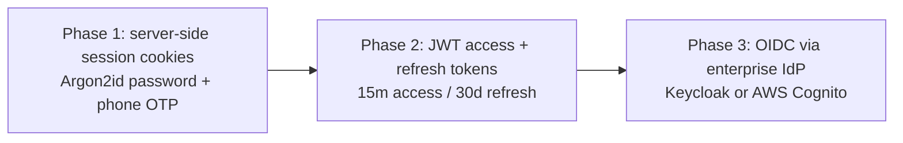
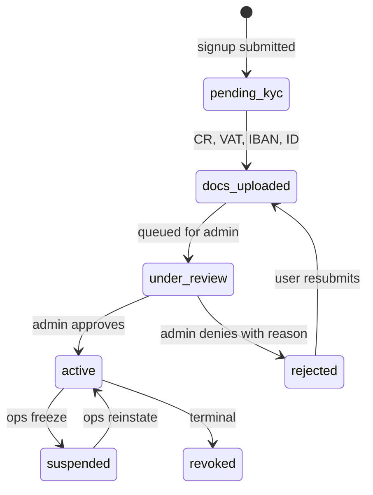

# IAM & RBAC — LAHTHA & CLICK

> Follow-up to [`ARCHITECTURE.md`](../../ARCHITECTURE.md) §3.1 and §4 (NFRs: identity).

## Principals
| Type | Domain | Onboarding | Phase 1 KYC level |
|---|---|---|---|
| `customer` | LAHTHA | Self-service signup | Phone OTP + email verify |
| `vendor` | LAHTHA | Admin-approved | Phone OTP + CR/VAT cert + bank IBAN |
| `dealer` | CLICK | Admin-approved | Vendor KYC + dealer agreement + initial wallet top-up |
| `admin` | Both | Hard-provisioned | SSO only (no password path) |
| `service` | Both | Machine principal | mTLS or signed API key |

A single human can hold **multiple principals** (e.g., a vendor who is also a dealer). Linkage is at the `person_id` level, not the principal level.

```sql
CREATE TABLE persons (
  person_id        UUID PRIMARY KEY,
  full_name        TEXT NOT NULL,
  national_id      VARCHAR(20),                       -- hashed; PII access audited
  primary_phone    VARCHAR(20) NOT NULL,
  created_at       TIMESTAMPTZ NOT NULL DEFAULT now(),
  UNIQUE (primary_phone)
);

CREATE TABLE users (
  user_id          UUID PRIMARY KEY,
  person_id        UUID NOT NULL REFERENCES persons(person_id),
  principal_type   TEXT NOT NULL
                   CHECK (principal_type IN ('customer','vendor','dealer','admin','service')),
  status           TEXT NOT NULL
                   CHECK (status IN ('pending_kyc','active','suspended','revoked')),
  created_at       TIMESTAMPTZ NOT NULL DEFAULT now(),
  UNIQUE (person_id, principal_type)
);
```

## Roles & permissions (RBAC)
```sql
CREATE TABLE roles (
  role_id          TEXT PRIMARY KEY,                  -- e.g. 'vendor.warehouse_manager'
  domain           TEXT NOT NULL CHECK (domain IN ('lahtha','click','platform')),
  description      TEXT
);

CREATE TABLE permissions (
  permission_id    TEXT PRIMARY KEY,                  -- e.g. 'lahtha.device.register'
  description      TEXT
);

CREATE TABLE role_permissions (
  role_id          TEXT REFERENCES roles(role_id),
  permission_id    TEXT REFERENCES permissions(permission_id),
  PRIMARY KEY (role_id, permission_id)
);

CREATE TABLE user_roles (
  user_id          UUID REFERENCES users(user_id),
  role_id          TEXT REFERENCES roles(role_id),
  granted_at       TIMESTAMPTZ NOT NULL DEFAULT now(),
  granted_by       UUID NOT NULL REFERENCES users(user_id),
  PRIMARY KEY (user_id, role_id)
);
```

### Seed roles (Phase 1)
| role_id | Owns |
|---|---|
| `customer.standard` | place orders, view own invoices |
| `vendor.owner` | manage vendor profile, list devices, view payouts |
| `vendor.warehouse_manager` | register IMEI, upload docs (cannot change payout) |
| `dealer.owner` | manage dealer profile, top up wallet, bid |
| `dealer.bidder` | place bids only (cannot withdraw funds) |
| `admin.support` | read-only across both domains |
| `admin.ops` | issue refunds, override states |
| `admin.compliance` | access PII, audit logs |

### Permission naming
`{domain}.{resource}.{action}` — e.g.:
- `lahtha.device.register`
- `lahtha.order.refund`
- `click.wallet.withdraw`
- `click.auction.close`
- `platform.user.suspend`

## Auth evolution


### Phase 1 — session cookies (MVP)
- Argon2id password hashing (`memory=64MB, iterations=3, parallelism=4`).
- Session table in Postgres; cookie is opaque + HttpOnly + Secure + SameSite=Lax.
- Phone OTP required on every new device login.
- Session TTL: 12h sliding, 7-day absolute.
- **Reason for not jumping straight to JWT**: MVP runs as a single deployment; session lookup is trivial; revocation is instant. JWT adds revocation complexity without buying anything yet.

### Phase 2 — JWT
- Triggered by: needing to scale to multiple backend services that can't share session DB cheaply.
- Access token: 15 min, signed RS256, claims = `{user_id, roles[], person_id}`.
- Refresh token: opaque, stored hashed in DB, revocable.
- Migration: dual-mode for 30 days — accept both session cookies and bearer tokens.

### Phase 3 — Enterprise IdP
- Externalize all auth to Keycloak / Cognito; backend only validates JWTs signed by IdP.
- Enables SSO for admin/staff, social login for customers, federated dealer login.
- LAHTHA & CLICK stop owning password storage.

## Authorization checks (Phase 1 pattern)
Every API handler declares its required permission as a decorator:
```python
@requires_permission('lahtha.device.register')
def register_device(request, payload):
    ...
```
The decorator:
1. Loads the user's effective permissions (cached for 60s).
2. Returns 403 if missing.
3. Logs the check (allow or deny) with `correlation_id` for audit.

## Audit
```sql
CREATE TABLE access_audit (
  audit_id         BIGSERIAL PRIMARY KEY,
  occurred_at      TIMESTAMPTZ NOT NULL DEFAULT now(),
  actor_user_id    UUID,
  acted_on_user_id UUID,
  permission_id    TEXT NOT NULL,
  decision         TEXT NOT NULL CHECK (decision IN ('allow','deny')),
  resource_ref     TEXT,                              -- e.g. 'device:550e8400-...'
  correlation_id   UUID,
  source_ip        INET,
  user_agent       TEXT
);

CREATE INDEX access_audit_actor_time ON access_audit (actor_user_id, occurred_at DESC);
CREATE INDEX access_audit_recent     ON access_audit (occurred_at DESC);
```
- Retention: 7 years (KSA tax + dispute window).
- Append-only at the app layer; no UPDATE or DELETE permitted on this table.
- Periodic export to cold storage every 90 days; older partitions detached.

## KYC workflow (vendor & dealer)


## Threat-model basics (Phase 1)
| Threat | Mitigation |
|---|---|
| Credential stuffing | per-account rate limit + IP-based velocity check + breached-password check (Have I Been Pwned offline list) |
| Session theft | bound to user agent fingerprint + IP /24; mismatch → re-OTP |
| Privilege escalation | role grants always logged; admin actions require step-up OTP |
| PII exposure | `national_id` column access requires `admin.compliance` role; reads logged |
| Insider abuse | admin-on-admin actions require a second admin's approval (two-person rule) |

## Out of scope (Phase 1)
- WebAuthn / passkeys (Phase 3 with IdP).
- ABAC / policy-as-code (OPA) — RBAC suffices until org grows past ~50 roles.
- Federated identity (Apple ID, Google) — Phase 2.
