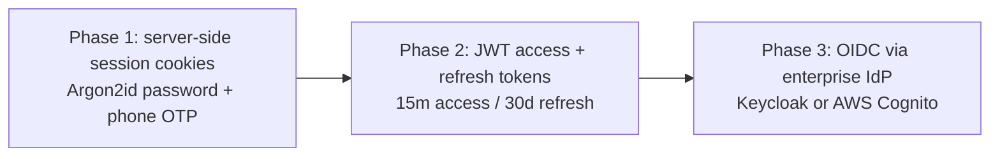
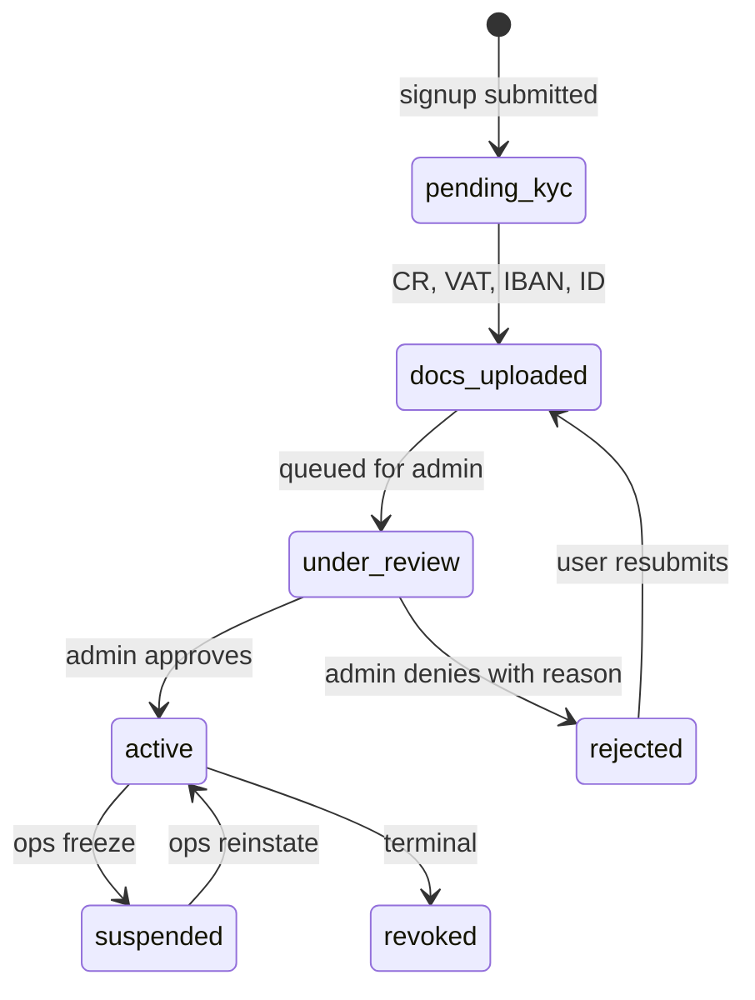

# IAM & RBAC — LAHTHA & CLICK

> Follow-up to [`ARCHITECTURE.md`](../../ARCHITECTURE.md) §3.1 and §4 (NFRs: identity).

## Principals
| Type | Domain | Onboarding | Phase 1 KYC level |
|---|---|---|---|
| `customer` | LAHTHA | Self-service signup | Phone OTP + email verify |
| `vendor` | LAHTHA | Admin-approved | Phone OTP + CR/VAT cert + bank IBAN |
| `dealer` | CLICK | Admin-approved | Vendor KYC + dealer agreement + initial wallet top-up |
| `admin` | Both | Hard-provisioned | SSO only (no password path) |
| `service` | Both | Machine principal | mTLS or signed API key |

A single human can hold **multiple principals** (e.g., a vendor who is also a dealer). Linkage is at the `person_id` level, not the principal level.

```sql
CREATE TABLE persons (
  person_id        UUID PRIMARY KEY,
  full_name        TEXT NOT NULL,
  national_id      VARCHAR(20),                       -- hashed; PII access audited
  primary_phone    VARCHAR(20) NOT NULL,
  created_at       TIMESTAMPTZ NOT NULL DEFAULT now(),
  UNIQUE (primary_phone)
);

CREATE TABLE users (
  user_id          UUID PRIMARY KEY,
  person_id        UUID NOT NULL REFERENCES persons(person_id),
  principal_type   TEXT NOT NULL
                   CHECK (principal_type IN ('customer','vendor','dealer','admin','service')),
  status           TEXT NOT NULL
                   CHECK (status IN ('pending_kyc','active','suspended','revoked')),
  created_at       TIMESTAMPTZ NOT NULL DEFAULT now(),
  UNIQUE (person_id, principal_type)
);
```

## Roles & permissions (RBAC)
```sql
CREATE TABLE roles (
  role_id          TEXT PRIMARY KEY,                  -- e.g. 'vendor.warehouse_manager'
  domain           TEXT NOT NULL CHECK (domain IN ('lahtha','click','platform')),
  description      TEXT
);

CREATE TABLE permissions (
  permission_id    TEXT PRIMARY KEY,                  -- e.g. 'lahtha.device.register'
  description      TEXT
);

CREATE TABLE role_permissions (
  role_id          TEXT REFERENCES roles(role_id),
  permission_id    TEXT REFERENCES permissions(permission_id),
  PRIMARY KEY (role_id, permission_id)
);

CREATE TABLE user_roles (
  user_id          UUID REFERENCES users(user_id),
  role_id          TEXT REFERENCES roles(role_id),
  granted_at       TIMESTAMPTZ NOT NULL DEFAULT now(),
  granted_by       UUID NOT NULL REFERENCES users(user_id),
  PRIMARY KEY (user_id, role_id)
);
```

### Seed roles (Phase 1)
| role_id | Owns |
|---|---|
| `customer.standard` | place orders, view own invoices |
| `vendor.owner` | manage vendor profile, list devices, view payouts |
| `vendor.warehouse_manager` | register IMEI, upload docs (cannot change payout) |
| `dealer.owner` | manage dealer profile, top up wallet, bid |
| `dealer.bidder` | place bids only (cannot withdraw funds) |
| `admin.support` | read-only across both domains |
| `admin.ops` | issue refunds, override states |
| `admin.compliance` | access PII, audit logs |

### Permission naming
`{domain}.{resource}.{action}` — e.g.:
- `lahtha.device.register`
- `lahtha.order.refund`
- `click.wallet.withdraw`
- `click.auction.close`
- `platform.user.suspend`

## Auth evolution

```mermaid
graph LR
    P1[Phase 1: server-side session cookies<br/>Argon2id password + phone OTP] --> P2
    P2[Phase 2: JWT access + refresh tokens<br/>15m access / 30d refresh] --> P3
    P3[Phase 3: OIDC via enterprise IdP<br/>Keycloak or AWS Cognito]
```

### Phase 1 — session cookies (MVP)
- Argon2id password hashing (`memory=64MB, iterations=3, parallelism=4`).
- Session table in Postgres; cookie is opaque + HttpOnly + Secure + SameSite=Lax.
- Phone OTP required on every new device login.
- Session TTL: 12h sliding, 7-day absolute.
- **Reason for not jumping straight to JWT**: MVP runs as a single deployment; session lookup is trivial; revocation is instant. JWT adds revocation complexity without buying anything yet.

### Phase 2 — JWT
- Triggered by: needing to scale to multiple backend services that can't share session DB cheaply.
- Access token: 15 min, signed RS256, claims = `{user_id, roles[], person_id}`.
- Refresh token: opaque, stored hashed in DB, revocable.
- Migration: dual-mode for 30 days — accept both session cookies and bearer tokens.

### Phase 3 — Enterprise IdP
- Externalize all auth to Keycloak / Cognito; backend only validates JWTs signed by IdP.
- Enables SSO for admin/staff, social login for customers, federated dealer login.
- LAHTHA & CLICK stop owning password storage.

## Authorization checks (Phase 1 pattern)
Every API handler declares its required permission as a decorator:
```python
@requires_permission('lahtha.device.register')
def register_device(request, payload):
    ...
```
The decorator:
1. Loads the user's effective permissions (cached for 60s).
2. Returns 403 if missing.
3. Logs the check (allow or deny) with `correlation_id` for audit.

## Audit
```sql
CREATE TABLE access_audit (
  audit_id         BIGSERIAL PRIMARY KEY,
  occurred_at      TIMESTAMPTZ NOT NULL DEFAULT now(),
  actor_user_id    UUID,
  acted_on_user_id UUID,
  permission_id    TEXT NOT NULL,
  decision         TEXT NOT NULL CHECK (decision IN ('allow','deny')),
  resource_ref     TEXT,                              -- e.g. 'device:550e8400-...'
  correlation_id   UUID,
  source_ip        INET,
  user_agent       TEXT
);

CREATE INDEX access_audit_actor_time ON access_audit (actor_user_id, occurred_at DESC);
CREATE INDEX access_audit_recent     ON access_audit (occurred_at DESC);
```
- Retention: 7 years (KSA tax + dispute window).
- Append-only at the app layer; no UPDATE or DELETE permitted on this table.
- Periodic export to cold storage every 90 days; older partitions detached.

## KYC workflow (vendor & dealer)

```mermaid
stateDiagram-v2
    [*] --> pending_kyc: signup submitted
    pending_kyc --> docs_uploaded: CR, VAT, IBAN, ID
    docs_uploaded --> under_review: queued for admin
    under_review --> active: admin approves
    under_review --> rejected: admin denies with reason
    rejected --> docs_uploaded: user resubmits
    active --> suspended: ops freeze
    suspended --> active: ops reinstate
    active --> revoked: terminal
```

## Threat-model basics (Phase 1)
| Threat | Mitigation |
|---|---|
| Credential stuffing | per-account rate limit + IP-based velocity check + breached-password check (Have I Been Pwned offline list) |
| Session theft | bound to user agent fingerprint + IP /24; mismatch → re-OTP |
| Privilege escalation | role grants always logged; admin actions require step-up OTP |
| PII exposure | `national_id` column access requires `admin.compliance` role; reads logged |
| Insider abuse | admin-on-admin actions require a second admin's approval (two-person rule) |

## OIDC SSO bearer authentication (implemented)

The gap this closes: the `admin` principal type above is specified as
**"SSO only (no password path)"**, but until now the only authentication path
in code was vendor OTP + session cookie (`lahtha-click/src/domains/iam/*`) —
`EntraMfaVerifier` existed, but only as an MFA *step-up* check on an already-
authenticated vendor session, never as a way to authenticate a request by
itself. This section documents the addition that lets an OIDC access token
authenticate a request outright, alongside session cookies.

**Where it lives**: `lahtha-click/src/domains/iam/oidc-verifier.ts` (token
verification), `oidc-authz.ts` (the Express middleware), and three new
methods on `RbacService` — `linkOidcIdentity`, `unlinkOidcIdentity`,
`resolveOidcPrincipal` — backed by a new `oidc_identity_links` Mongo
collection (`(issuer, subject) -> userId`).

### How it composes with session auth

```
app.use(createOidcAuthzMiddleware(rbac))   // global, before every domain router
  -> if the bearer token is JWT-shaped (3 segments) AND verifies AND its
     (issuer, subject) is linked to an RBAC user: req.principalUserId set,
     req.principalAuthMethod = 'oidc'
  -> otherwise: falls through, principal left unset

iam.authz.requirePermission(...)           // per-route, every domain
  -> if req.principalUserId is already set (by the middleware above): skip
     session resolution entirely
  -> otherwise: resolve the opaque session cookie/bearer token as before
```

One middleware, mounted once in `src/app.ts`, gives every existing domain
router (vendor, inventory, listing, checkout, payment — anything already
built on `iam.authz.requirePermission`) SSO support with no changes to those
files. `GET /iam/me` reports which path authenticated the request
(`authMethod: 'session' | 'oidc'`) and omits `session` (null) for an SSO
request, since there is no session record to describe.

### Never JIT-provisioned — always an explicit link

An OIDC subject the RBAC service has never seen resolves to **no principal**,
not a new account. This is a deliberate consequence of "admin is
hard-provisioned" above: auto-creating an account for anyone who can produce
a valid token from the configured IdP would silently violate that rule the
first time IdP-side group membership was misconfigured. Instead, an admin
holding `platform.iam.manage` links an existing RBAC user to an
`(issuer, subject)` pair explicitly:

```
POST   /iam/users/:userId/oidc-link   { issuer, subject }   -> 204 (idempotent)
DELETE /iam/oidc-link                 { issuer, subject }   -> 204 | 404
```

Both are gated on `platform.iam.manage`, the same permission that gates role
grants and status changes. `linkOidcIdentity` refuses to relink a subject
already claimed by a different user (`RbacConflictError`, 409) — a subject
maps to exactly one principal.

### Provider-agnostic by design

`GenericOidcVerifier` only relies on the OIDC discovery + JWKS spec (issuer,
audience, standard claims), not a provider-specific claim shape, so it works
against Keycloak, Cognito, Auth0, Okta, or Entra without provider-specific
code. It is deliberately **not** shared with `EntraMfaVerifier`, which keeps
its own copy of the same JWT/JWKS mechanics — see the comment at the top of
`oidc-verifier.ts` for why (that file has zero test coverage today; reusing
its logic for a new path would risk a regression in a working flow for a
cosmetic DRY win).

Config (`.env`, all optional — unset means SSO bearer auth is disabled and
only session-cookie auth is available, same fail-closed posture as
`ENTRA_*`):

| Var | Purpose |
|---|---|
| `OIDC_ISSUER` | Expected `iss` claim; also the discovery base (`${OIDC_ISSUER}/.well-known/openid-configuration`) unless `OIDC_JWKS_URI` is set. |
| `OIDC_AUDIENCE` | Expected `aud` claim — this app's client/resource id at the IdP. |
| `OIDC_JWKS_URI` | Skips discovery entirely when set. |
| `OIDC_ROLES_CLAIM` | Claim name carrying role/group strings, if the IdP embeds them (default `roles`). Currently surfaced on `OidcClaims` but not yet auto-synced into RBAC role grants — see Assumptions below. |

### Assumptions flagged (rather than asked)

Per your ask to keep building rather than pause on domain specifics that
don't have a single right answer without your input:

1. **No specific IdP chosen.** The verifier is provider-agnostic by
   construction so this decision is deferred without blocking anything —
   pointing `OIDC_ISSUER`/`OIDC_AUDIENCE` at Keycloak, Cognito, Auth0, or
   Entra all work identically.
2. **SSO gates every domain globally, not just `/iam`.** The middleware is
   mounted once in `src/app.ts`, ahead of all domain routers, rather than
   only inside the IAM sub-router — matching `authz`'s own doc comment
   ("reusable by other domains") and letting an admin's SSO token exercise
   `platform.*` permissions anywhere, not just IAM management endpoints.
3. **An invalid or unlinked OIDC token fails through silently, not with a
   distinct error.** `attachOidcPrincipal` swallows verification failures
   and unlinked subjects alike, leaving the principal unset so session auth
   (or the eventual 401) takes over. The user sees a generic
   `unauthenticated` rather than "your SSO token is invalid/expired" or
   "your SSO account isn't linked yet." This mirrors `attachPrincipal`'s
   existing best-effort pattern and avoids the alternative failure mode —
   rejecting outright on a stale bearer header even when a valid session
   cookie is also present. Revisit if better error specificity is needed for
   support/debugging.
4. **`OIDC_ROLES_CLAIM` is parsed but not applied.** `GenericOidcVerifier`
   extracts a roles/groups claim from the token if configured, but nothing
   currently maps those into RBAC role grants — authorization still runs
   entirely off `user_roles` (`RoleGrantRepository`) via the linked
   `userId`. Wiring IdP-asserted groups into automatic role grants is a
   real design decision (which IdP groups map to which of *this* app's
   roles, and whether that sync is JIT-on-login or a separate admin action)
   that needs your input before building — flagged rather than guessed.
5. **Link/unlink has no HTTP test for the "already linked to someone else"
   409 path** at the route layer (it's covered at the service layer in
   `rbac-service.test.ts`) — a reasonable trim given the route is a thin
   validate-then-call-the-service wrapper like every other route in this
   file.

### Out of scope (unchanged from this doc's original scope)
- WebAuthn / passkeys.
- ABAC / policy-as-code (OPA) — RBAC suffices until org grows past ~50 roles.
- Auto-provisioning an RBAC user from IdP-only signup (Google/Apple social
  login for customers) — still deferred; what's built here is IdP
  *authentication* for an already-provisioned principal, not signup.
- Syncing IdP group/role claims into `user_roles` automatically (see
  Assumption 4).

## Out of scope (Phase 1)
- WebAuthn / passkeys (Phase 3 with IdP).
- ABAC / policy-as-code (OPA) — RBAC suffices until org grows past ~50 roles.
- Federated identity (Apple ID, Google) — Phase 2.
