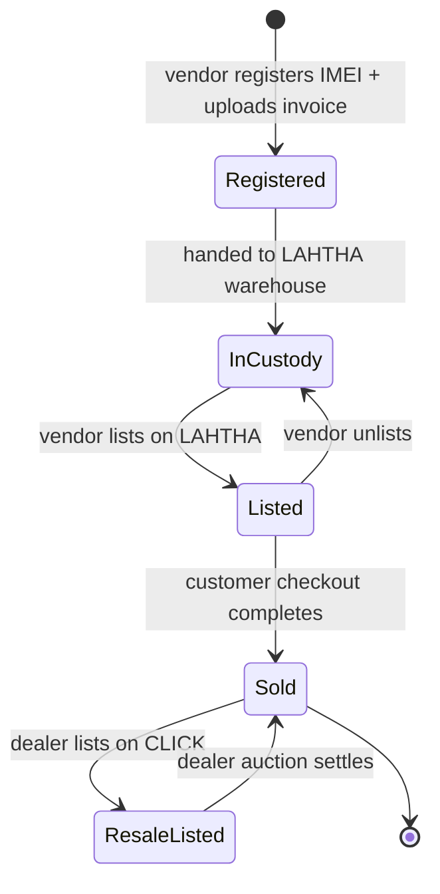

# IMEI Inventory Schema — LAHTHA

> Follow-up to [`ARCHITECTURE.md`](../../ARCHITECTURE.md) §3 (Inventory & Verification Engine).

## Goals
- **Global IMEI uniqueness**: an IMEI exists at most once in the entire platform, ever.
- **Append-only ownership history**: every transfer is a new row; we never UPDATE history.
- **Proof artifacts**: each device carries metadata pointing to S3-stored documents (invoice scans, supplier certificates).
- **Phase 1 PostgreSQL**: enforced at the DB layer, not just app layer.

## Core tables

```sql
-- 1. The device itself (one row per physical unit, forever)
CREATE TABLE devices (
  device_id        UUID         PRIMARY KEY,
  imei             VARCHAR(15)  NOT NULL,
  imei2            VARCHAR(15),                       -- dual-SIM models
  serial_number    VARCHAR(64)  NOT NULL,
  model_code       TEXT         NOT NULL,             -- e.g. 'A3105'
  model_name       TEXT         NOT NULL,             -- e.g. 'iPhone 17 Pro'
  storage_gb       INT,
  color            TEXT,
  condition        TEXT         NOT NULL
                   CHECK (condition IN ('new_sealed','open_box','refurbished','used')),
  created_at       TIMESTAMPTZ  NOT NULL DEFAULT now(),
  registered_by    UUID         NOT NULL REFERENCES users(user_id)
);

-- IMEI is globally unique (Luhn-valid 15 digits)
CREATE UNIQUE INDEX devices_imei_unique  ON devices (imei);
CREATE UNIQUE INDEX devices_imei2_unique ON devices (imei2) WHERE imei2 IS NOT NULL;
CREATE UNIQUE INDEX devices_serial_unique ON devices (serial_number);

ALTER TABLE devices
  ADD CONSTRAINT imei_is_15_digits  CHECK (imei  ~ '^[0-9]{15}$'),
  ADD CONSTRAINT imei2_is_15_digits CHECK (imei2 IS NULL OR imei2 ~ '^[0-9]{15}$');
```

```sql
-- 2. Ownership history (append-only)
CREATE TABLE device_ownership (
  ownership_id     UUID         PRIMARY KEY,
  device_id        UUID         NOT NULL REFERENCES devices(device_id),
  owner_id         UUID         NOT NULL REFERENCES users(user_id),
  owner_type       TEXT         NOT NULL
                   CHECK (owner_type IN ('vendor','customer','dealer','lahtha_custody')),
  acquired_at      TIMESTAMPTZ  NOT NULL,
  acquisition_type TEXT         NOT NULL
                   CHECK (acquisition_type IN
                          ('initial_registration','purchase','auction_win','transfer_in')),
  source_event_id  UUID,                              -- references the order / auction / saga
  released_at      TIMESTAMPTZ,                       -- null = current owner
  created_at       TIMESTAMPTZ  NOT NULL DEFAULT now()
);

-- One current owner per device — partial unique index
CREATE UNIQUE INDEX device_current_owner
  ON device_ownership (device_id)
  WHERE released_at IS NULL;

CREATE INDEX device_ownership_by_owner
  ON device_ownership (owner_id, released_at);
```
The `released_at IS NULL` partial unique index is the single source of truth for "who owns this device right now". An ownership transfer happens in **one** transaction:
```sql
BEGIN;
UPDATE device_ownership
   SET released_at = now()
 WHERE device_id   = $1
   AND released_at IS NULL;

INSERT INTO device_ownership (ownership_id, device_id, owner_id, owner_type, acquired_at, acquisition_type, source_event_id)
VALUES (gen_random_uuid(), $1, $2, $3, now(), $4, $5);
COMMIT;
```

```sql
-- 3. Proof-of-ownership documents (metadata only; bytes on S3)
CREATE TABLE device_documents (
  document_id      UUID         PRIMARY KEY,
  device_id        UUID         NOT NULL REFERENCES devices(device_id),
  document_type    TEXT         NOT NULL
                   CHECK (document_type IN
                          ('supplier_invoice','customs_clearance','imei_certificate','box_photo','other')),
  s3_bucket        TEXT         NOT NULL,
  s3_key           TEXT         NOT NULL,
  sha256           CHAR(64)     NOT NULL,             -- tamper detection
  mime_type        TEXT         NOT NULL,
  size_bytes       BIGINT       NOT NULL,
  uploaded_by      UUID         NOT NULL REFERENCES users(user_id),
  uploaded_at      TIMESTAMPTZ  NOT NULL DEFAULT now(),
  UNIQUE (s3_bucket, s3_key)
);

CREATE INDEX device_documents_by_device ON device_documents (device_id, document_type);
```

## Device lifecycle

The state is **derived** from the ownership chain + active listings — we don't store a `status` column on `devices` because that creates a denormalization that drifts.

## Validation rules (enforced in code, layered above DB)
1. **Luhn checksum** on IMEI before INSERT (app layer; the regex CHECK only enforces shape).
2. **Model code allowlist** — pre-loaded table of valid Apple model codes; INSERT rejected for unknown codes.
3. **Mandatory documents on registration**: a vendor cannot register a device without at least one `supplier_invoice` document attached in the same transaction.
4. **No self-transfer**: ownership transfer rejected if new `owner_id == previous owner_id`.

## S3 layout
```
s3://lahtha-device-docs-prod/
  └── devices/{device_id}/
       ├── invoice/{document_id}.pdf
       ├── certificate/{document_id}.pdf
       └── photos/{document_id}.jpg
```
- Bucket: versioned + Object Lock in **governance mode** with 7-year retention (KSA tax record retention).
- Server-side encryption with KMS.
- Presigned URLs for uploads (max 15-minute TTL).

## Migration plan
- Phase 1: Alembic baseline migration creates these three tables.
- No data migration from SQLite — Phase 1 launches with empty inventory.
- Indexes created CONCURRENTLY in subsequent migrations to allow zero-downtime adds.

## Out of scope
- IMEI blacklist checks against GSMA — deferred to Phase 2.
- Multi-region S3 replication — Phase 3.
- Hardware fingerprinting (chip ID) — not on roadmap.
