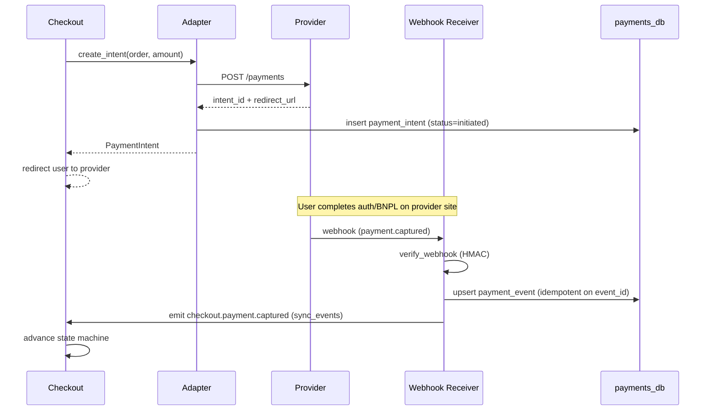

# Payment Gateway Adapters — LAHTHA

> Follow-up to [`ARCHITECTURE.md`](../../ARCHITECTURE.md) §5 (Integration & Data Flow).

## Goals
- A **single internal contract** that the checkout state machine talks to, regardless of provider.
- Each provider (Moyasar, Checkout.com, Tabby, Tamara) is an isolated **adapter** behind that contract.
- All amounts are **decimal-safe**; all operations are **idempotent**; all state changes are **driven by webhooks**, never optimistic.

## Internal contract

```python
class PaymentAdapter(Protocol):
    provider_id: str  # 'moyasar', 'checkout', 'tabby', 'tamara'

    def create_intent(self, request: PaymentIntentRequest) -> PaymentIntent:
        """Idempotent by (order_id, attempt_no)."""

    def capture(self, intent_id: str, amount: Decimal) -> CaptureResult:
        """Idempotent by intent_id."""

    def refund(self, capture_id: str, amount: Decimal, idempotency_key: str) -> RefundResult:
        """Idempotent by idempotency_key."""

    def verify_webhook(self, headers: Mapping[str, str], raw_body: bytes) -> WebhookEvent:
        """Returns a normalized event or raises InvalidSignature."""
```

```python
@dataclass(frozen=True)
class PaymentIntentRequest:
    order_id: UUID
    attempt_no: int                # increments on retry; part of idempotency
    amount: Decimal                # always SAR for Phase 1
    currency: str                  # 'SAR'
    customer: CustomerRef
    payment_method_hint: str       # 'card', 'bnpl_tabby', 'bnpl_tamara', etc.
    return_url: str
    metadata: Mapping[str, str]    # invoice_id, vendor_id, etc.

@dataclass(frozen=True)
class PaymentIntent:
    intent_id: str                 # provider's id, namespaced as 'moyasar:pi_xxx'
    status: Literal['initiated','requires_action','captured','failed']
    redirect_url: str | None       # for 3DS or BNPL handoff
    raw_provider_payload: dict     # stored for audit, never trusted for state
```

## Provider quirks matrix
| Concern | Moyasar | Checkout.com | Tabby | Tamara |
|---|---|---|---|---|
| Auth | API key (Basic) | OAuth client creds | Bearer | Bearer |
| Idempotency header | not native (we dedupe by `(order_id, attempt_no)`) | `Cko-Idempotency-Key` | `Idempotency-Key` | `Idempotency-Key` |
| 3DS handling | redirect via `source.transaction_url` | redirect via `_links.redirect.href` | n/a (BNPL flow) | n/a (BNPL flow) |
| Webhook signature | HMAC-SHA256, header `X-Moyasar-Signature` | HMAC-SHA256, `Cko-Signature` | HMAC-SHA256, `X-Tabby-Signature` | HMAC-SHA256, `Tamara-Signature` |
| Refund window | unlimited (per docs) | unlimited | 30 days | 180 days |
| Partial refund | yes | yes | yes (one-shot per order) | yes |
| Settlement currency | SAR | multi → SAR | SAR | SAR |
| Sandbox | live test mode keys | sandbox subdomain | sandbox API base | sandbox API base |

Each adapter is a single module under `app/payments/adapters/{provider}.py` implementing the protocol.

## Flow


## State store
```sql
CREATE TABLE payment_intents (
  intent_id         TEXT PRIMARY KEY,                 -- 'moyasar:pi_xxx'
  provider          TEXT NOT NULL,
  order_id          UUID NOT NULL REFERENCES orders(order_id),
  attempt_no        INT  NOT NULL,
  amount            NUMERIC(18,2) NOT NULL,
  currency          CHAR(3) NOT NULL,
  status            TEXT NOT NULL
                    CHECK (status IN
                           ('initiated','requires_action','captured','failed','refunded','partially_refunded')),
  created_at        TIMESTAMPTZ NOT NULL DEFAULT now(),
  updated_at        TIMESTAMPTZ NOT NULL DEFAULT now(),
  UNIQUE (order_id, attempt_no)
);

CREATE TABLE payment_events (
  event_id          TEXT PRIMARY KEY,                 -- provider's event id; idempotency key
  intent_id         TEXT NOT NULL REFERENCES payment_intents(intent_id),
  event_type        TEXT NOT NULL,                    -- 'captured','failed','refunded','disputed'
  amount            NUMERIC(18,2),
  raw_payload       JSONB NOT NULL,                   -- verbatim provider body
  received_at       TIMESTAMPTZ NOT NULL DEFAULT now()
);

CREATE TABLE refunds (
  refund_id         UUID PRIMARY KEY,
  intent_id         TEXT NOT NULL REFERENCES payment_intents(intent_id),
  amount            NUMERIC(18,2) NOT NULL,
  reason            TEXT NOT NULL,
  idempotency_key   TEXT NOT NULL UNIQUE,
  status            TEXT NOT NULL
                    CHECK (status IN ('pending','succeeded','failed')),
  created_at        TIMESTAMPTZ NOT NULL DEFAULT now()
);
```

## Webhook handling rules
1. **Verify signature first.** Reject before any DB write if HMAC fails.
2. **Idempotent insert** by provider event ID — duplicate webhooks are common, especially on Tabby/Tamara retry storms.
3. **Don't trust webhook state transitions blindly** — re-fetch the intent from the provider before applying terminal states (`captured`, `refunded`) for orders > 5,000 SAR.
4. **Webhook timeout target**: 2s response. Heavy work (state-machine advance, invoice generation) goes through `sync_events`.
5. **Replay protection**: store `event_id` for 90 days; reject older replays.

## Failure modes
| Failure | Adapter behavior |
|---|---|
| Provider 5xx on `create_intent` | retry: `1s, 2s, 4s` then surface to user as "try again" |
| Provider 4xx (invalid card, declined) | no retry; map to user-facing error code |
| Webhook lost (provider outage) | nightly reconciliation job pulls intent status from each provider |
| Late webhook (order already closed) | log + alert; do not auto-act |
| Refund permanently fails | open ops case; manual ledger adjustment + customer comms |

## Reconciliation
Nightly job per provider:
1. Pull all settlements for the previous business day.
2. Reconcile against `payment_events` of type `captured`.
3. Surface discrepancies (missing settlement = potential fraud or webhook loss).
4. Generate accounting export (CSV) for finance.

## Security
- Provider credentials live in **AWS Secrets Manager** (or equivalent); no `.env` keys in prod.
- HMAC verification keys rotated every 90 days; rolling-window acceptance for 24h after rotation.
- All adapter calls go through an **egress proxy** with allowlisted provider hostnames — prevents SSRF.

## Out of scope (Phase 1)
- Mada-specific tokenization optimizations.
- Apple Pay / Google Pay (Phase 2 — adds wallet adapter type).
- Cross-border settlement currency.
- Marketplace split payments (vendor-direct payout) — Phase 3.
