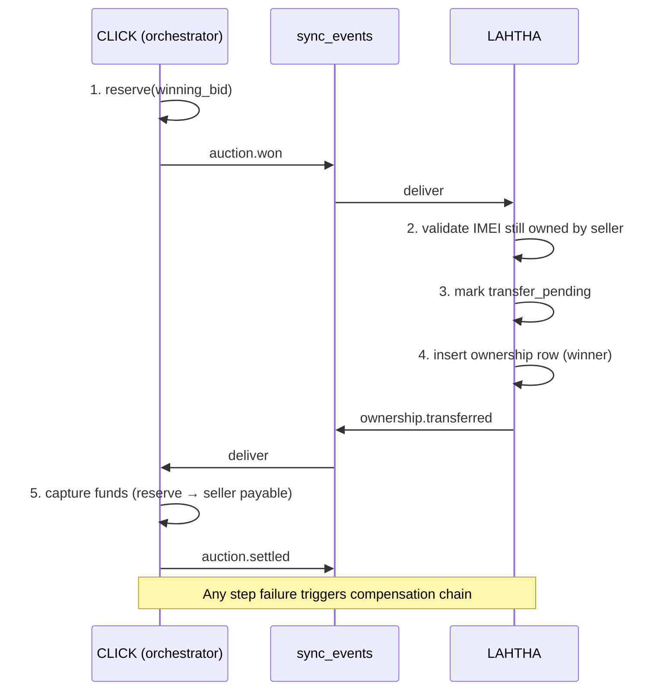

# Saga Compensation Patterns — LAHTHA ↔ CLICK

> Follow-up to [`ARCHITECTURE.md`](../../ARCHITECTURE.md) §6: "Distributed transaction integrity".

## Problem statement
- **LAHTHA** is the authority for IMEI inventory and ownership transfer.
- **CLICK** runs dealer auctions and the wallet ledger.
- A winning auction in CLICK triggers ownership transfer in LAHTHA.
- Without an explicit cross-domain protocol, a partial failure (e.g., CLICK captures funds but LAHTHA fails to transfer ownership) leaves the two domains permanently inconsistent.

## Approach: orchestrated saga
A **saga orchestrator** in CLICK drives each settlement as a sequence of local transactions. Every step:
1. Is **idempotent** (keyed by `saga_id` + `step_name`).
2. Emits an event to the shared `sync_events` table.
3. Has a matching **compensation** that reverses its effect.

## Happy-path flow


## Compensation matrix
| Forward step | Compensation | Notes |
|---|---|---|
| 5. capture funds | `funds.refunded` — move from seller payable back to winner wallet | Must succeed before #4 compensation |
| 4. insert ownership | `ownership.reverted` — restore seller as owner | Append new row; never UPDATE history |
| 3. mark transfer_pending | clear flag | Local to LAHTHA |
| 1. reserve funds | `funds.released` — release reserve to winner's available balance | |

Compensations run in **reverse order** of completed forward steps.

## Idempotency store
```sql
CREATE TABLE saga_steps (
  saga_id        UUID        NOT NULL,
  step_name      TEXT        NOT NULL,
  status         TEXT        NOT NULL
                 CHECK (status IN ('pending','completed','compensated','failed')),
  attempt        INT         NOT NULL DEFAULT 0,
  payload        JSONB,
  result         JSONB,
  created_at     TIMESTAMPTZ NOT NULL DEFAULT now(),
  completed_at   TIMESTAMPTZ,
  PRIMARY KEY (saga_id, step_name)
);

CREATE INDEX saga_steps_status_idx
  ON saga_steps (status)
  WHERE status IN ('pending','failed');
```
Each step handler is wrapped:
```python
def execute_step(saga_id, step_name, fn, payload):
    row = upsert_pending(saga_id, step_name, payload)
    if row.status == 'completed':
        return row.result  # idempotent replay
    try:
        result = fn(payload)
        mark_completed(saga_id, step_name, result)
        return result
    except TransientError:
        bump_attempt(saga_id, step_name)
        raise  # retry policy decides next
    except PermanentError:
        mark_failed(saga_id, step_name)
        trigger_compensation(saga_id)
        raise
```

## Retry policy
- **Transient** (network, 5xx, lock timeout): exponential backoff `1s, 2s, 4s, 8s, 16s`, max 5 attempts → dead-letter.
- **Permanent** (validation, business rule violation): no retry, immediately compensate.
- **Compensation retries**: unbounded with backoff capped at 5min; **alert ops** after 5 failed attempts (a stuck compensation = real money in limbo).

## Orphan inventory mode
If forward step 4 fails *permanently* (e.g., the IMEI was fraudulently transferred outside the platform between auction open and close):
1. Refund the winner in full (step 1 compensation).
2. **Suspend** the seller's wallet — no withdrawals, no new listings.
3. Open an **admin dispute** case with all collected evidence (bid log, IMEI history, timestamps).
4. **Never** auto-retry settlement — requires human review.

This is the only path where a compensation does not fully restore symmetry; the buyer is made whole but the seller relationship is paused.

## Observability requirements
- Every saga emits structured logs with `saga_id` as the correlation ID.
- Metric: `saga_duration_seconds` (histogram), `saga_compensation_total` (counter, labelled by `reason`).
- Dashboard: open sagas older than 60s, compensations open longer than 5min.

## Out of scope (for now)
- Two-phase commit (XA) — rejected because LAHTHA and CLICK will become separate DBs/services in Phase 3.
- Event sourcing for the wallet ledger — possible Phase 4 evolution, not required for saga correctness.
