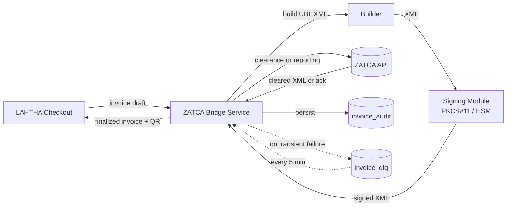

# ZATCA E-Invoicing Integration — LAHTHA

> Follow-up to [`ARCHITECTURE.md`](../../ARCHITECTURE.md) §4–§5: compliance and integration points.

## Scope
Saudi Arabia **ZATCA Phase 2 (Integration)** — every tax invoice is digitally signed and either **cleared** with ZATCA in real time (B2B) or **reported** within 24 hours (B2C).

Phase 1 (Generation) is already in force; this doc covers what LAHTHA must implement for Phase 2 readiness.

## Two flows

| Mode | Use case | Sync requirement |
|---|---|---|
| **Clearance** | B2B — standard tax invoice | Sign → send to ZATCA → wait for cleared XML → only then deliver to buyer |
| **Reporting** | B2C — simplified tax invoice | Sign → deliver to buyer immediately → report to ZATCA within 24h |

LAHTHA's product mix (consumer + dealer) requires **both** flows.

## Architecture


## Invoice draft contract — LAHTHA → ZATCA Bridge
```json
{
  "invoice_type": "clearance",
  "issue_datetime": "2026-05-26T18:32:11+03:00",
  "supplier": {
    "vat_number": "300000000000003",
    "name": "LAHTHA Trading",
    "address": { "city": "Riyadh", "country": "SA" }
  },
  "customer": {
    "vat_number": "311111111100003",
    "name": "Buyer LLC"
  },
  "lines": [
    {
      "description": "iPhone 17 Pro 256GB",
      "imei": "356938035643809",
      "quantity": 1,
      "unit_price": "4347.83",
      "vat_rate": "0.15",
      "vat_amount": "652.17",
      "total": "5000.00"
    }
  ],
  "totals": {
    "subtotal":    "4347.83",
    "vat_total":   "652.17",
    "grand_total": "5000.00"
  }
}
```

**All monetary fields are strings** — JSON numbers are not safe for decimal arithmetic. The bridge parses them with `Decimal` and never via `float`.

## Signing
- Each branch (point of sale) has a **CSID** (Cryptographic Stamp Identifier) issued by ZATCA.
- **EGS** (E-invoice Generation Solution) certificate is provisioned once per branch.
- Private keys live in an HSM (or PKCS#11 device); the signing module signs by reference, never exporting the key.
- The signed XML embeds the QR code (Base64 TLV) that B2C buyers scan to verify.

```
+----------------+        sign() RPC        +-----------------+
| ZATCA Bridge   | -----------------------> | Signing Module  |
|                | <----------------------- | (HSM-backed)    |
+----------------+      signed UBL XML      +-----------------+
```

## Failure handling
| Failure | Action |
|---|---|
| ZATCA 5xx / network | retry: `1s, 2s, 4s, 8s, 16s` → DLQ |
| ZATCA 4xx validation | **no retry**; surface to ops dashboard with the validation message |
| Signing failure | block checkout; page on-call (you cannot legally complete the sale) |
| Clearance pending > 30s | buyer sees "processing" screen; bridge keeps polling for clearance up to 5 min |
| DLQ replay exhausted (~23h for reporting) | human escalation; failure to report = ZATCA fine |

DLQ replay job: consumes `invoice_dlq` every 5 min, attempts `submit_to_zatca` again. Reporting-mode invoices have a hard deadline of 24h from issue, so the job alerts at the 20h mark if anything is still pending.

## Audit storage
```sql
CREATE TABLE invoice_audit (
  invoice_id      UUID        PRIMARY KEY,
  order_id        UUID        NOT NULL,
  invoice_type    TEXT        NOT NULL CHECK (invoice_type IN ('clearance','reporting')),
  zatca_uuid      TEXT,                          -- assigned by ZATCA on success
  zatca_qr        TEXT,                          -- Base64 QR (B2C receipts)
  signed_xml      TEXT        NOT NULL,
  cleared_xml     TEXT,                          -- null until cleared
  hash_chain_prev TEXT,                          -- previous invoice's hash
  hash_chain_curr TEXT        NOT NULL,          -- this invoice's hash
  status          TEXT        NOT NULL
                  CHECK (status IN ('signed','submitted','cleared','reported','failed')),
  created_at      TIMESTAMPTZ NOT NULL DEFAULT now(),
  finalized_at    TIMESTAMPTZ
);

-- Hash chain continuity is required by ZATCA: each invoice must reference the
-- previous one's hash. Enforced as a unique index.
CREATE UNIQUE INDEX invoice_audit_chain_unique
  ON invoice_audit (hash_chain_prev)
  WHERE hash_chain_prev IS NOT NULL;
```

The hash chain makes any after-the-fact tampering with a historical invoice detectable: changing one row invalidates every chain link that follows. This satisfies the **immutability** NFR from `ARCHITECTURE.md` §4.

## Test environment
- **ZATCA Fatoora sandbox** with sandbox CSIDs for end-to-end tests.
- Synthetic fixtures for both clearance and reporting flows.
- Negative tests we must pass: invalid VAT numbers, unsupported currencies, rounding edge cases (1/3 SAR), invoices that cross a fiscal year boundary.

## Service boundaries
- The **ZATCA Bridge** is the only LAHTHA component that talks to ZATCA. The checkout state machine treats invoice clearance as an async outcome via `sync_events` (`invoice.cleared`, `invoice.failed`).
- This keeps the checkout path decoupled from ZATCA's availability — if the bridge is down, B2C sales continue (reporting mode) and only B2B clearance is blocked.

## Out of scope
- Credit / debit note flows — required eventually for refunds, but separate work.
- Multi-supplier (marketplace) invoicing — LAHTHA is currently single-supplier.
- E-invoicing in other jurisdictions (UAE, Egypt) — Phase 4+.
