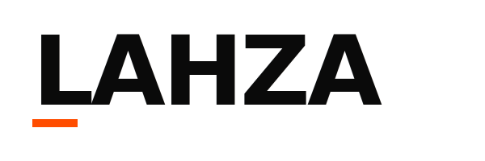
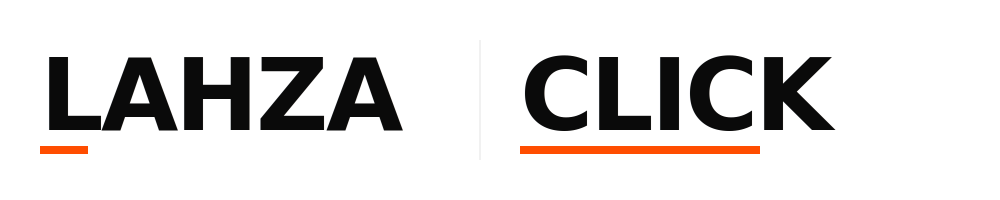

# Brand Identity — LAHZA & CLICK
## Bold Minimalism

> Visual identity proposal for owner review. Direction: **Bold Minimalism** — restraint with intention.

---

## 1. The Idea

**LAHZA** (لحظة, "the moment") is the trustworthy front door — clean, decisive, premium. **CLICK** is the marketplace pulse — sharp, fast, marketplace-energy. They share the same DNA. Same typography. Same accent. The brand never shouts. It states.

The system is built on three rules:

1. **Two colors.** Ink + paper. One accent. Nothing else.
2. **Type does the work.** Wordmarks are massive. Type is the design.
3. **Whitespace is a feature.** If in doubt, add more space.

---

## 2. Color System

Three colors. That is the whole palette.

| Role | Token | Hex | Use |
|---|---|---|---|
| **Ink** | `--ink` | `#0A0A0A` | All text, all wordmarks, all primary surfaces on dark mode. Near-black (not pure `#000`) for screen comfort. |
| **Paper** | `--paper` | `#FFFFFF` | Default surface. Generous use. |
| **Accent** | `--accent` | `#FF4D00` | A single high-energy orange. **Used sparingly** — one accent per screen, max. CTAs, key indicators, the underline beneath each wordmark. |

Functional neutrals (used quietly, never decoratively):

| Token | Hex | Use |
|---|---|---|
| `--ink-60` | `#666666` | Secondary text |
| `--ink-20` | `#E5E5E5` | Hairlines, dividers |
| `--success` | `#00A86B` | Confirmation |
| `--danger` | `#E11D2A` | Errors |

> **Why one accent?** Bold minimalism is about restraint. Two accents = decorated. One accent = decisive. The `#FF4D00` is warm enough to feel KSA-rooted, electric enough to feel modern.

---

## 3. Typography

One family. One job. **Size carries the meaning.**

- **Latin / numerics:** [Inter](https://rsms.me/inter/) — open source, screen-optimized.
- **Arabic:** [IBM Plex Sans Arabic](https://www.ibm.com/plex/) — open source, sits cleanly next to Inter.

### Type scale (intentionally aggressive)

| Token | px | Use |
|---|---|---|
| `text-xs` | 12 | captions only |
| `text-sm` | 14 | metadata |
| `text-base` | 16 | body |
| `text-lg` | 20 | secondary headlines |
| `text-2xl` | 32 | section heads |
| `text-4xl` | 56 | page heads |
| `text-6xl` | 80 | hero |
| `text-8xl` | 112 | wordmark on the splash |

Weights: `400` regular, `600` semibold for emphasis, **`900` black for all hero and wordmark use**.

Numerics use `font-variant-numeric: tabular-nums`. Prices align in tables.

---

## 4. Logos

Bold minimalism logos are wordmarks. No icon. No mascot. The wordmark *is* the mark.

### LAHZA
A short orange block sits beneath the **L** — the "moment." Small. Decisive.



### CLICK
A full-width orange block underlines the entire word — the "complete action."


### LAHZA × CLICK
The ecosystem mark. Used in footers and unified surfaces.



### Usage rules
| Do | Don't |
|---|---|
| Use the ink-on-paper version on white backgrounds | Don't add a stroke, shadow, or gradient |
| Use the paper-on-ink version on the `--ink` background | Don't rotate, skew, or distort |
| Keep clear space ≥ `cap-height` of the wordmark on all sides | Don't place text or graphics inside the clear-space |
| Minimum width: 80px on screen, 25mm in print | Don't reproduce smaller |
| Keep the accent block proportional to the wordmark | Don't recolor the block to any non-accent value |

---

## 5. Voice & Tone

### Universal principles
1. **Arabic first, but plain-spoken.** We write the way people actually speak — never news-anchor formal.
2. **Numbers and facts before adjectives.** "iPhone 17 Pro · 256GB · مختوم · ضمان سنة" beats "أفضل آيفون متاح".
3. **Total transparency.** Commission, fees, delivery dates: stated up front. No surprises in checkout.
4. **No manufactured urgency.** No "ends in 3 minutes" theatrics. We are not a flash-sale app.

### Brand-specific voice
- **LAHZA**: calm, certain, the way an Apple Store senior speaks. *"جهازك جاهز في فرع الرياض."*
- **CLICK**: direct, alive, the way a busy market manager speaks. *"بِعت! 4,850 ريال. تحويل خلال 24 ساعة."*

### Words we use
| Use | Don't use |
|---|---|
| "جهازك" | "المنتج" |
| "العملية" / "الطلب" | "Transaction" |
| "موثّق" | "Verified ✓" inside Arabic |
| "سوق" / "كلِك" | "Marketplace" |
| "تاجر" | Direct transliteration of "Dealer" |

---

## 6. Layout & Spacing

Bold minimalism = generous whitespace. **8px base grid.**

Spacing scale: `4 · 8 · 12 · 16 · 24 · 32 · 48 · 64 · 96 · 128 · 192`.

| Surface | Minimum padding | Notes |
|---|---|---|
| Mobile screen | 24px sides | |
| Desktop content | 48px sides | Maximum content width: 1280px |
| Card | 32px all around | |
| Hero section | 128px vertical | Bigger than you think. |

### Radius
| Token | px | Use |
|---|---|---|
| `radius-none` | 0 | Tables, structural surfaces |
| `radius-sm` | 4 | Inputs |
| `radius-md` | 8 | Buttons, badges |
| `radius-lg` | 16 | Cards, modals |
| `radius-full` | 9999 | Avatars |

### Elevation (used minimally)
| Token | CSS | Use |
|---|---|---|
| `shadow-sm` | `0 1px 2px rgba(10,10,10,0.06)` | Hover on inputs |
| `shadow-md` | `0 8px 24px rgba(10,10,10,0.08)` | Dropdowns, popovers |
| `shadow-lg` | `0 24px 56px rgba(10,10,10,0.12)` | Modals only |

> A bold-minimalist UI uses **borders and whitespace** to create hierarchy, not shadows.

---

## 7. Iconography

- Line icons only. 1.5px stroke.
- 24×24 grid. Round caps and joins.
- Single color: `--ink` or `--accent`.
- Source: [Lucide](https://lucide.dev) (open source, MIT) — consistent line weight, RTL-friendly.

---

## 8. Application Examples

### Splash / first screen
```
[                                                          ]
[                                                          ]
[                                                          ]
[                  LAHZA                                   ]
[                  ▬▬▬                                     ]
[                                                          ]
[                  لحظة                                    ]
[                                                          ]
[                                                          ]
[                                                          ]
```
Wordmark at `text-8xl`. Accent block. Arabic at `text-lg`. The whole screen is whitespace and one word.

### Product card
- Image: 1:1, no border-radius beyond `radius-lg`.
- Title at `text-lg` weight `600`.
- Price at `text-2xl` weight `900` — the visual anchor.
- One badge maximum (e.g., "موثّق").
- No drop shadow. Just a 1px `--ink-20` border.

### Primary CTA
- Background: `--ink`, text: `--paper`. *Or* background: `--accent`, text: `--paper`.
- Height: 48px (mobile), 56px (desktop).
- Padding: 24px horizontal.
- Weight: `600`, never `900` (block ink shouts; the button doesn't have to).

---

## 9. App Icon (preview)

A monochrome ink-on-paper tile with a single `--accent` block — the same visual hook as the LAHZA wordmark's underline. Produced as a separate asset bundle in the launch prep workstream.

---

## 10. What's Next

1. [ ] Owner sign-off on direction (bold minimalism, this palette, LAHZA spelling).
2. [ ] Codify tokens in `lahtha-click-web/` (see [`design-tokens.md`](./design-tokens.md)).
3. [ ] Production Figma library + brand PDF (out of scope for this PR).
4. [ ] App icon set (PNG @ 1×/2×/3×, SVG, ICO) when frontend ships.
