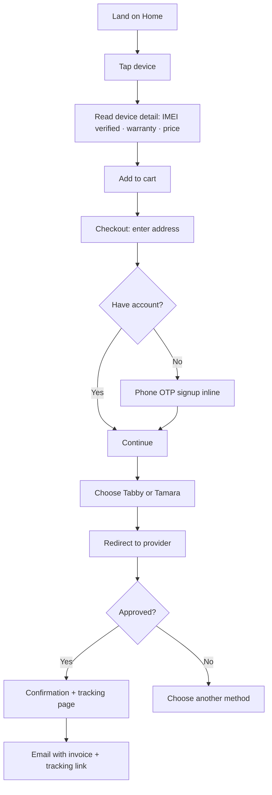
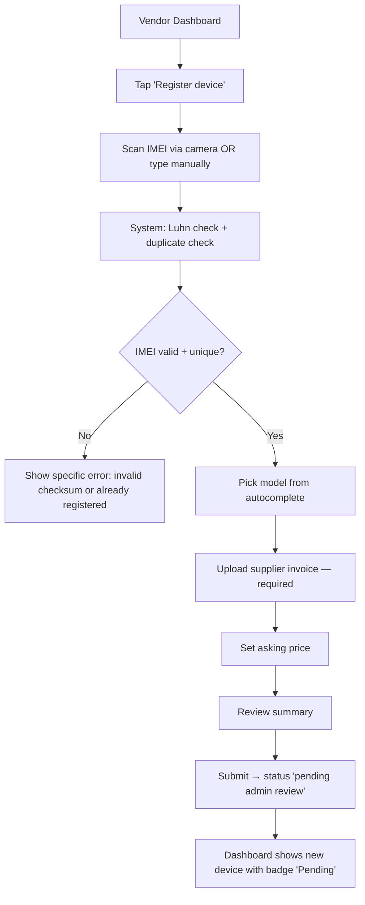
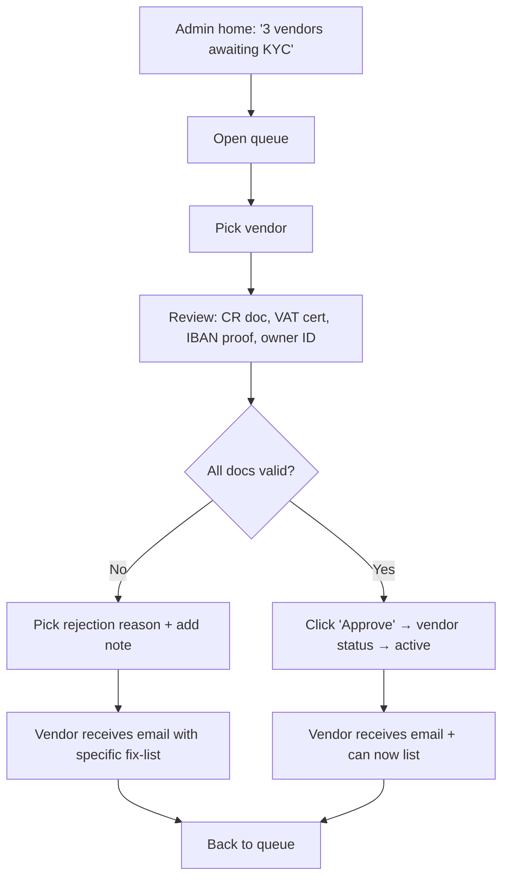
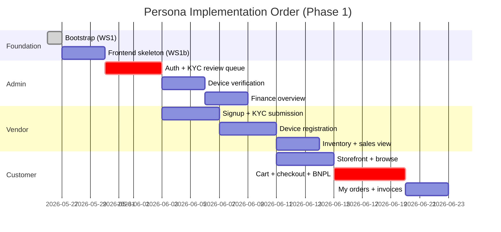

# Persona Roadmap — Admin / Vendor / End User

> Step 3 of the foundation: the UX vision for the three tracks the platform must serve. Each track is broken down into the user's goal, their key screens, the canonical flows, and the "friendly use" principles applied. Implementation order at the bottom.

## Friendly-use principles (apply to all three tracks)

1. **One primary action per screen.** Every screen has exactly one thing it wants you to do. Everything else is secondary.
2. **The next step is obvious without reading.** Visual hierarchy → primary CTA → secondary actions → meta info.
3. **Show state, never make people guess.** "Pending review · 2 hours ago" beats no status.
4. **No surprise dead-ends.** Every error has a fix-path or a "contact support" CTA.
5. **Arabic-first, RTL-correct.** Every layout designed RTL first, mirrored LTR if needed.
6. **Mobile-first for end users.** Desktop-first for admin. Vendor sees both equally.
7. **Money is never ambiguous.** Prices include VAT; commissions are line items; net is bold.

---

## Track 1: End User (الزبون النهائي)

### Goal
Buy a verified Apple device, pay with BNPL or direct, get a receipt, track delivery.

### Permissions
`customer.standard` role — browse, buy, view own orders.

### Key screens (mobile-first)
| # | Screen | Primary action |
|---|---|---|
| 1 | **Home / Browse** | "تصفح أحدث الأجهزة" — browse by model |
| 2 | **Search results** | Tap a device card |
| 3 | **Device detail** | "أضف إلى السلة" — primary CTA fixed at bottom |
| 4 | **Cart** | "ادفع الآن" |
| 5 | **Checkout — address** | "التالي" |
| 6 | **Checkout — payment** | Choose BNPL (Tabby / Tamara) or future direct; one tap |
| 7 | **Confirmation** | "تتبع طلبك" |
| 8 | **My Orders** | View past, track current, download invoice |
| 9 | **Order tracking** | Live state: prepared → shipped → delivered |
| 10 | **Account** | Profile, addresses, payment methods, language |

### Canonical flow: first purchase

### Friendly-use applied
- **No account required to browse.** Signup is inline at checkout (phone OTP, < 30 seconds).
- **Price shown is final price.** VAT included. BNPL shows "أو ٤ دفعات بقيمة ١٢٥٠ ر.س" directly under main price.
- **IMEI verified badge** is the first thing on the device card — that's the brand promise.
- **One CTA visible at all times.** Sticky bottom button on every detail page.
- **The cart is never hidden.** Persistent icon with count.

---

## Track 2: Vendor (التاجر / البائع)

### Goal
Register devices with proof, list them, track sales, request payouts.

### Permissions
`vendor.owner` for the account holder. `vendor.warehouse_manager` for delegated staff (can register inventory, cannot withdraw funds).

### Key screens (mobile + desktop, equal weight)
| # | Screen | Primary action |
|---|---|---|
| 1 | **Vendor Dashboard** | "سجّل جهازاً جديداً" |
| 2 | **Register Device** | Scan/enter IMEI → upload invoice → set price → "أضف للمخزون" |
| 3 | **Inventory** | View all devices: in custody, listed, sold |
| 4 | **Device detail** | Edit listing, view sale history |
| 5 | **Sales** | Filter by date / model / status; download invoices |
| 6 | **Payouts** | Available balance + "اطلب تحويل" |
| 7 | **Documents** | Upload/refresh CR, VAT cert, IBAN proof |
| 8 | **Staff** | Add warehouse manager users (vendor.owner only) |
| 9 | **Settings** | Profile, notifications, payout bank |

### Canonical flow: register a new device

### Friendly-use applied
- **Inventory dashboard answers two questions immediately**: "what can I sell?" and "what am I waiting on?"
- **Errors are specific.** Not "IMEI invalid". Always "IMEI fails Luhn checksum" or "IMEI 35693… is already registered to vendor X".
- **Money is gross AND net side by side.** "Listed: 5,000 SAR · You receive: 4,750 SAR after 5% commission".
- **Payout request is one screen, one tap** — preview the bank transfer details before confirming.
- **Camera IMEI scanning** is opt-in but prominent — faster than typing.

---

## Track 3: Admin (مسؤول النظام)

### Goal
Approve vendors, verify devices, resolve disputes, monitor finances, configure rules.

### Permissions
- `admin.support` — read-only across both domains.
- `admin.ops` — issue refunds, override states.
- `admin.compliance` — access PII, audit logs.

### Key screens (desktop-first)
| # | Screen | Primary action |
|---|---|---|
| 1 | **Admin home** | Three counters: vendors awaiting KYC, devices awaiting verification, open disputes |
| 2 | **Vendor approvals** | KYC review queue with one-click approve/reject |
| 3 | **Device verification** | Inventory queue: see uploaded invoice, IMEI history, approve/reject |
| 4 | **Orders** | All orders, filter by status, ability to drill in |
| 5 | **Disputes** | Open disputes, message thread, resolution actions |
| 6 | **Finance overview** | Daily revenue, commission earned, pending payouts, refunds |
| 7 | **Refunds** | Issue refund + auto credit note |
| 8 | **Users** | Search any user, view audit trail, suspend |
| 9 | **System config** | Commission rates per category, supported brands, payment provider toggles |
| 10 | **Audit log** | Every admin action, filterable by actor + action + time |

### Canonical flow: approve a vendor

### Friendly-use applied
- **Queues, not search.** Admin homepage IS three queues; nothing is "find via search if you remember it exists".
- **Every decision has a reason field.** Approvals and rejections both — for audit trail.
- **Bulk actions only for safe operations.** Bulk approve devices = OK. Bulk refund = explicit confirm per row.
- **Two-person rule for sensitive ops** (per `iam-rbac.md`). The UI shows "awaiting second admin approval" status.
- **Audit trail is one click away** from every action — admins know they're being watched.

---

## Implementation order

Build sequence (smallest viable slice per track first):

**Why admin first?** Without the admin queue, no vendor can be approved, no device verified — the system literally cannot serve a customer. Admin is the unblocker.

**Why customer storefront before vendor inventory finishes?** Because the customer experience defines what data each device card needs — backfilling the vendor flow once is cheaper than rewriting the storefront after.

## Acceptance for "friendly use"

A persona is shipped when **a non-technical person from that role can complete the canonical flow on the first try, without help**, on the appropriate device class.

This will be validated with one usability test per persona before each persona's PR is merged to main.
